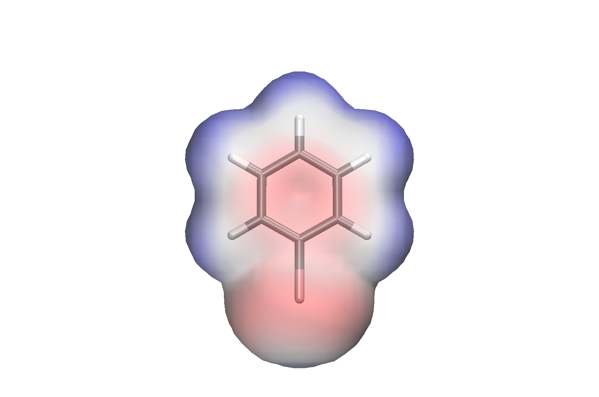
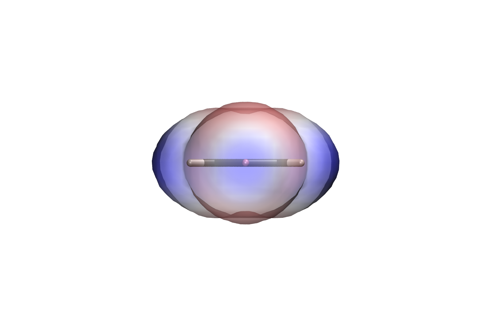
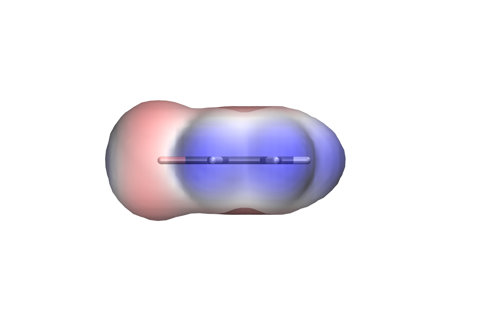
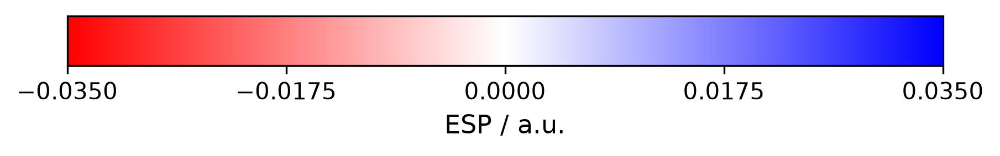

# ESP Visualization — VMD

**User Guide for deploying the VMD ESP Visualization Tool**

This repository is the continuation of
[`Pymol_esp_visualization`](https://github.com/FlxLfr/Pymol_esp_visualization).
It is a **visualisation tool only**: it turns Turbomole `pointval` output into
the same standard set of ESP figures, drawn in VMD instead of PyMOL.

> **The σ-hole potential is computed in the PyMOL project, not here.** Locating
> the σ-hole maximum needs trilinear interpolation onto the isosurface, and that
> code is written, parameter-studied and documented over there. This pipeline
> computes only V_S,min and V_S,max on the ρ = 0.001 a.u. shell, because without
> them there is no colour scale and therefore no meaningful picture. **Quote the
> PyMOL numbers.** The ones here size a colour bar. What else the sister project
> can do is listed in [section 9](#9-what-the-pymol-pipeline-does-and-this-one-does-not).

| Aspect | Details |
|---|---|
| Input | Turbomole `pointval` grids (`td.xyz`, `tp.xyz`) + a structure file |
| Output | Gaussian cube files, a ready-to-run VMD scene (`esp.tcl`), a standard set of PNG images, a CSV of surface ESP statistics |
| Software | Python 3 + NumPy + VMD 1.9.4, all free |
| Manual steps | Installing VMD, establishing a conda environment and firing a command |

<p align="center">
  
  
  
</p>
<p align="center">
  
</p>

<p align="center"><em>Bromobenzene: π face, view along the C–Br axis (σ-hole), in-plane profile, and the colour scale that belongs to them. These are the committed reference images, rendered from the decimated reference grid.</em></p>

---

## Contents

1. [Installation](#1-installation)
    - [1.1 Prerequisite: VMD](#11-prerequisite-vmd)
    - [1.2 Create the environment](#12-create-the-environment)
    - [1.3 Verify & Smoketest](#13-verify--smoketest)
2. [Input files and formats](#2-input-files-and-formats)
3. [One molecule, step by step](#3-one-molecule-step-by-step)
    - [3.1 Convert the grids to cubes and create the VMD scene (`xyzToCubeToVMDVis.py`)](#31-convert-the-grids-to-cubes-and-create-the-vmd-scene-xyztocubetovmdvispy)
    - [3.2 Look at it interactively (`esp.tcl`)](#32-look-at-it-interactively-esptcl)
    - [3.3 Render the standard image set (`render_espVMD.py`)](#33-render-the-standard-image-set-render_espvmdpy)
4. [Several molecules at once (`run_allVMD.py`)](#4-several-molecules-at-once-run_allvmdpy)
5. [What the workflow writes](#5-what-the-workflow-writes)
6. [Console output](#6-console-output)
7. [Create Tp.xyz, Td.xyz and a structure file from a SMILES notation](#7-create-tpxyz-tdxyz-and-a-structure-file-from-a-smiles-notation)
8. [Repository layout](#8-repository-layout)
9. [What the PyMOL pipeline does and this one does not](#9-what-the-pymol-pipeline-does-and-this-one-does-not)


---

## 1. Installation

### 1.1 Prerequisite: VMD

Download from the
[TCBG test release page](https://www.ks.uiuc.edu/Research/vmd/alpha/) (free
registration) and take **Version 1.9.4, "Windows 64-bit, CUDA, OptiX, OSPray"**.
Version 2.0.0 exists as a monthly alpha and is deliberately not used here — see `docs/Details.docx`.

VMD is not a conda package and the Windows installer does **not** put it on the
`PATH`. The scripts find it anyway: they check the `PATH`, then the `VMDDIR`
environment variable that the installer does set, then the usual install
folders. Only if all three fail do you need `--vmd "C:\Program Files\VMD\vmd.exe"`
or a `PATH` entry. The PowerShell snippet for that is in `docs/Details.docx`.

### 1.2 Create the environment

This assumes a working conda; if you have none, follow §1.1 of the PyMOL
project's README first.

```bash
conda env create -f environment.yml
conda activate esp-vmd
```

| Packages inside the env | Needed for |
|---|---|
| `numpy` | everything, grid handling in all scripts |
| `matplotlib` | the separate `*_colorbar.png` only |
| `pillow` | converting VMD's TGA output to PNG |

The `esp-pymol` environment from the sister project works just as well — it
already has all three, and VMD does not come from conda either way.

### 1.3 Verify & Smoketest

Validate the correct deployment of the conda environment:

```bash
python -c "import numpy, matplotlib, PIL; print('ok')"
```

The smoke test is run by executing the batch script without any parameters:

```bash
cd scripts
python run_allVMD.py
```

Without parameters `run_allVMD.py` runs on `reference/brombenzol/`. It converts,
writes the scene, renders, and puts the images in
`reference/brombenzol/images_check/` plus a summary in
`reference/summary_check.csv`. The `_check` names are deliberate: the smoke test
must never overwrite the committed reference files, otherwise you can no longer
tell whether the reference is still the reference.

Compare your `images_check/` with the committed `images/` and your
`summary_check.csv` with `summary.csv`. On the decimated reference grid expect:

| | |
|---|---|
| V_S,min | −0.01863 a.u. |
| V_S,max | +0.03070 a.u. |
| colour scale | ±0.0350 a.u. |
| shell points | 313 |

**These are the same numbers the PyMOL pipeline reports.** Both reference sets
are built from the same bromobenzene data with the same parameters, and both
derive V_S from grid points near the ρ = 0.001 shell. That is the point of the
test: it cross-checks the two pipelines, not just this one. If your numbers
match, the installation is sound and any remaining difference between the two
image sets is the viewer, not the data.

The reference grid is decimated to 0.60 Bohr — five times coarser than the
delivered data — and is far too coarse for a V_S value you would quote. It
answers "does the installation run and do the documented numbers come out", not
"how big is the σ-hole".

---

## 2. Input files and formats

Per molecule, in one folder:

| File | Content | Units |
|---|---|---|
| `td.xyz` | Turbomole `pointval` **total density** grid | Bohr |
| `tp.xyz` | Turbomole `pointval` **total potential** (ESP) grid | Bohr |
| `*.mol` / `*.sdf` / `*.xyz` | molecular structure | Å (default) |

**`td.xyz` and `tp.xyz` are not structure files** despite the extension. They are
ASCII point clouds with one line per grid point, carrying the full coordinates
plus the value:

```
#grid1  start  -15.000000  delta    0.120000  points    251
#electrostatic potential
# cartesian coordinates x,y,z and f(x,y,z)
      -15.00000000   -15.00000000   -15.00000000   -0.00054019
```

At 251³ points that is about 1.25 GB per file. The same information as a `.cube`
is roughly 200 MB, because the cube format stores the grid implicitly.

### Accepted structure formats

| Format | Notes |
|---|---|
| `.xyz` | `Symbol x y z`. With or without the leading atom-count and comment lines; a bare coordinate list is accepted. Default Å, changeable with `--struct-unit`. |
| `.mol` | MDL molfile, V2000 and V3000. **Coordinates come *before* the element symbol**, the reverse of xyz. Always Å. |
| `.sdf` | SD-file; only the first record (up to `$$$$`) is read. Always Å. |

`--struct-unit` applies to `.xyz` only. Molfile coordinates are in Ångström by
definition, so the option is ignored for them.

**The structure file is needed once, for the conversion only.** Unlike the PyMOL
pipeline, nothing downstream reads it again: `xyzToCubeToVMDVis.py` writes the
atom positions into the cube header, and VMD then takes geometry *and* grid from
that one file. There is no second source of coordinates that could disagree with
the grid, so the classic "molecule floats next to its own surface" failure mode
does not exist here.

Do not try to open the Turbomole-derived `.xyz` files in VMD directly — they have
no XYZ header, and VMD's reader aborts with "Unable to load molecule". Load the
cube instead; it carries the atoms.

---

## 3. One molecule, step by step

The three commands below are one molecule's full path from Turbomole output to
finished images. For a whole folder of molecules, skip to §4.

### 3.1 Convert the grids to cubes and create the VMD scene (`xyzToCubeToVMDVis.py`)

```bash
cd scripts
python xyzToCubeToVMDVis.py --struct ../path/to/molecule.mol ../path/to/td.xyz ../path/to/tp.xyz
```

Writes `td.cube`, `tp.cube` and a ready-to-run `esp.tcl` next to the input files.
Which grid is density and which is potential is detected from the file header,
not from the file name. Expect a minute or two per grid.

#### Positional argument

| Argument | Meaning |
|---|---|
| `grids` | one or more Turbomole `pointval` files, e.g. `td.xyz tp.xyz`. Any number can be given; each produces one `.cube` next to it (or in `--outdir`). Existing `.cube` files are accepted here too, which is what `--tcl-only` uses. |

#### Options that change the **cube files**

| Option | Default | Effect |
|---|---|---|
| `--struct`, `-s` | *required* | structure file, `.xyz` / `.mol` / `.sdf`. Its atoms go into the cube header. Not needed with `--tcl-only`. |
| `--struct-unit {angstrom,bohr}` | `angstrom` | unit of the structure file. `.xyz` only. |
| `--outdir`, `-o` | next to the input | write the cube files and `esp.tcl` somewhere else. |
| `--stride N` | `1` | keep every N-th grid point per axis. `2` → **8× smaller** files. |
| `--quiet`, `-q` | off | suppress progress output. |

#### Options that change only the generated `esp.tcl`

| Option | Default | Effect |
|---|---|---|
| `--tcl-only` | off | rewrite `esp.tcl` from the existing cubes, touching no grid. Sub-second instead of minutes. |
| `--no-vmd` | off | cubes only, no scene. |
| `--esp-range` | `auto` | half-width of the colour scale in a.u., or `auto` derived from V_S,min/V_S,max on the shell. |
| `--iso` | `0.001` | isovalue of the density surface drawn in the scene. |
| `--opacity` | `0.50` | surface opacity, 0…1. `1.0` = opaque. Not comparable to PyMOL's `transparency` — see `docs/Details.docx`. |
| `--scale` | `auto` | zoom, a number or `auto` — from the molecule's size and the window height. |
| `--fill` | `0.85` | fraction of the image height the molecule fills at `--scale auto`. |
| `--color-scale` | `RWB` (`RGB` with `--rainbow`) | VMD colour scale. `RWB` is red-negative; `BWR` reverses it. An explicit value wins over `--rainbow`. |
| `--rainbow` | off | rainbow ramp instead of red–white–blue; writes `esp_rainbow.tcl` so the standard scene survives. |

#### Examples

```bash
# standard: cubes + interactive scene
python xyzToCubeToVMDVis.py --struct mol.mol td.xyz tp.xyz

# fast pass: 8x smaller cubes, images look identical
python xyzToCubeToVMDVis.py --struct mol.mol td.xyz tp.xyz --stride 2

# structure file already in Bohr, cubes into a separate "out" folder
python xyzToCubeToVMDVis.py --struct mol.xyz --struct-unit bohr --outdir ../out td.xyz tp.xyz

# change the scene only, from cubes that already exist
python xyzToCubeToVMDVis.py td.cube tp.cube --tcl-only --esp-range 0.035 --opacity 1.0

# second scene with the rainbow ramp, the standard one is kept
python xyzToCubeToVMDVis.py td.cube tp.cube --tcl-only --rainbow
```

**Never re-run the conversion just to change the scene.** Converting takes
minutes; `--tcl-only` reads the two cube headers, works out which is which and
rewrites the scene in well under a second. `--struct` is not needed then.

What the converter takes care of, which is where hand-rolled conversions usually
go wrong:

* **Index order.** Turbomole varies *x* fastest, the cube format varies *z*
  fastest. Without reordering you get a transposed, mirrored molecule.
* **Units.** The grid is in Bohr, the structure file is normally in Å (factor
  1.8897).
* **Interrupted writes.** A cube is written as `<name>.cube.part` and renamed
  only when complete, so a run stopped halfway cannot leave a half file with a
  valid header behind.
* **The view orientation.** The three standard views are computed from the
  geometry — ring normal, C–halogen axis — and baked into `esp.tcl` as rotation
  matrices. Same calculation as the PyMOL pipeline, so both image sets show the
  same thing.

---

### 3.2 Look at it interactively (`esp.tcl`)

Before rendering anything, check that the scene is what you expect:

```bash
vmd -e esp.tcl
```

or, inside a running VMD, in the Tk Console (`Extensions → Tk Console`):

```tcl
cd {C:/path/to/molecule}
source esp.tcl
```

Forward slashes and braces, not backslashes — Tcl reads `\` as an escape
character.

The script loads both cubes into one molecule ID, builds the ρ = 0.001
isosurface from the density and colours it by the potential. The skeleton comes
from the cube's own atom block, so it cannot be misaligned.

These commands are defined by the scene:

| Command | Effect |
|---|---|
| `esp_view pi \| edge \| sigma` | the three standard views |
| `esp_iso <value>` | change the isovalue live |
| `esp_range <half-width>` | change the colour scale live |
| `esp_opacity <0…1>` | change the surface opacity live |
| `esp_snapshot <name>` | ray-traced image via Tachyon |

Tune with the live commands first, then bake the value you settled on into the
file with `--tcl-only`, so the scene reproduces itself.

`esp.tcl` always carries the colour scale that was actually used for that
molecule's images, plus the axis the σ view follows, so what you see
interactively matches the figure set.

---

### 3.3 Render the standard image set (`render_espVMD.py`)

Run it from inside the molecule folder, where `esp.tcl` and the cubes are:

```bash
cd ../sandbox/brombenzol
python ../../scripts/render_espVMD.py
```

Output goes to `images/`. The script drives VMD for the three views, converts
VMD's TGA output to PNG and draws the colour bar with matplotlib.

Three views are produced, oriented **from the molecular geometry**:

| File | View | Shows |
|---|---|---|
| `*_pi.png` | perpendicular to the molecular plane | π system, ring hydrogens |
| `*_sigma.png` | along the C–halogen axis, from outside | **the σ-hole, head on** |
| `*_edge.png` | in the molecular plane | overall profile |

Every molecule therefore lands in the same orientation automatically — that is
what makes an image set comparable, and it is why no manual rotation is needed or
wanted. For molecules without a halogen, `*_sigma.png` looks down the longest
principal axis instead; read the file name as "axial view" in that case.

#### Options

| Option | Default | Effect |
|---|---|---|
| `--outdir` | `images` | output folder |
| `--scene` | `esp.tcl` (`esp_rainbow.tcl` with `--rainbow`) | scene file to render; the smoke test uses `esp_check.tcl` |
| `--rainbow` | off | render the rainbow scene into a separate `<prefix>_rainbow_*` set |
| `--res` | `1600x1280` | image size in px |
| `--headless` | off | start VMD without a window (`-dispdev text`) — see below |
| `--ao` | off | ambient occlusion: soft shadows in the recesses, slower |
| `--shadows` | off | cast shadows. Off on purpose: they drop the sticks onto the isosurface as grey capsules that look like a data artefact. PyMOL renders without them too. |
| `--keep-tga` | off | keep VMD's intermediate TGA files |
| `--dpi` | `300` | resolution of the colour bar |
| `--vmd` | autodetect | path to `vmd.exe` |
| `--no-vmd` | off | do not call VMD; only convert existing TGA files and build the bar |

#### Examples

```bash
# everything autodetected in the current molecule folder
python ../../scripts/render_espVMD.py

# no window, full resolution, deeper shading
python ../../scripts/render_espVMD.py --headless --res 2400x1920 --ao

# second image set with the rainbow ramp, standard set kept
python ../../scripts/render_espVMD.py --rainbow

# only rebuild the colour bar, do not touch VMD
python ../../scripts/render_espVMD.py --no-vmd

# VMD not on the PATH
python ../../scripts/render_espVMD.py --vmd "C:\Program Files\VMD\vmd.exe"
```

**`--headless` keeps the window shut.** VMD normally opens its OpenGL window for
every pass, which over nine molecules is a dozen windows stealing focus.
`--headless` starts it with `-dispdev text`: no window, no OpenGL. Tachyon still
renders — it works from the scene graph, not from the framebuffer — and the image
size then comes from `-size` on the command line rather than `display resize`, so
it is no longer capped by your screen.

**The renderer falls back, and the fallback is recorded.** Tachyon can abort on
the axial view, where the line of sight crosses many transparent layers. The
script then re-renders the missing views as an OpenGL window capture, which keeps
the transparency, and only failing that as an opaque surface. Which pass produced
which view is written into `*_settings.txt` and `summary.csv` — when a figure was
made a different way, that must not disappear from the record. The window capture
is the one pass that genuinely needs a window, so `--headless` defers rather than
removes it: the window appears only when Tachyon has already failed.

**The colour bar comes from matplotlib, not from VMD.** VMD has no legend object,
and neither has PyMOL, so both pipelines draw it the same way, as a separate PNG.

**On `--rainbow`.** It selects VMD's `RGB` scale: smallest value red, middle
green, largest blue — the same direction as the PyMOL ramp, so the two rainbow
sets read the same way round. They do not look identical, though. VMD
interpolates linearly between three anchor colours, so a quarter of the way up
you get olive rather than yellow and three quarters of the way up teal rather
than cyan; PyMOL's ramp has five anchors and shows those tones pure. Endpoints,
the zero point and the width of the scale are the same in both. The colour bar
follows VMD rather than PyMOL, because it is the legend for *this* picture — the
rainbow bar is correspondingly darker in the middle than its PyMOL counterpart.

Rainbow output never collides with the standard set: the scene is
`esp_rainbow.tcl`, the images are `<prefix>_rainbow_pi.png` and so on. Use it as
a second, alternative set — red–white–blue stays the one to publish, because a
rainbow ramp has no perceptually neutral midpoint and invites reading structure
into the intermediate colours that is not in the data.

---

## 4. Several molecules at once (`run_allVMD.py`)

Put each molecule in its own folder under a common root — for your own data that
is `sandbox/`, which git ignores:

```
sandbox/
├── bromobenzene/   td.xyz  tp.xyz  bromobenzene.mol
├── iodobenzene/    td.xyz  tp.xyz  iodobenzene.mol
└── chlorobenzene/  td.xyz  tp.xyz  chlorobenzene.mol
```

Then:

```bash
cd scripts
python run_allVMD.py --root ../sandbox --headless
```

This converts what needs converting, writes an `esp.tcl` next to each molecule's
cube files, renders every molecule and collects `summary.csv` at the root. Called
**without arguments** it runs on `reference/` instead — the smoke test from §1.3.

**It analyses first and renders once.** V_S,min and V_S,max come out of the cube
files, so no rendering is needed to find them.

**No second pass — a recommendation instead.** Images are only comparable on one
shared scale, and the PyMOL pipeline renders twice to get there (`--two-pass`).
In VMD an image costs a minute or two, so the first set would be waste. Every run
therefore ends with the smallest scale that covers all molecules, and the
ready-made command line to render with it:

```
Jedes Molekuel hat seine eigene Skala - 0.0350, 0.0500, 0.0700 a.u.
Nebeneinanderlegen darf man die Bilder so NICHT.
Kleinster Wert, der alle abdeckt: +/- 0.0700 a.u.
Zum Rendern eines vergleichbaren Satzes:

    python run_allVMD.py --root ../sandbox --esp-range 0.0700
```

You read it, decide what the figure should show, and start the run that counts —
the smallest scale that clips nothing is not always the most informative one. A
single molecule with a very negative oxygen flattens the contrast of every other
molecule in the set, and that is a judgement call. Set a fixed value that is too
small and the run says so: which molecules it clips, and what they would need.

### Options

| Option | Default | Effect |
|---|---|---|
| `--root` | `reference/` | directory tree to search for molecule folders |
| `--only NAME …` | all | restrict the run to these folders; simple wildcards allowed, e.g. `--only Pyridine '*-Pyr'` |
| `--stride N` | `1` | grid decimation **during conversion**. Ignored when the cube files already exist — use `--force-convert` to rebuild them. |
| `--struct-unit {angstrom,bohr}` | `angstrom` | as in the converter; `.xyz` only |
| `--force-convert` | off | rewrite cube files even if they already exist |
| `--esp-range` | `auto` | `auto` (each molecule on its own scale), a fixed value in a.u., or `common` (one scale for all, straight from this run) |
| `--iso` | `0.001` | density isovalue, passed through |
| `--opacity` | `0.50` | passed through |
| `--scale`, `--fill` | `auto`, `0.85` | zoom, passed through |
| `--color-scale` | `RWB` (`RGB` with `--rainbow`) | passed through |
| `--rainbow` | off | rainbow ramp; writes `esp_rainbow.tcl` and a separate `<molecule>_rainbow_*` set |
| `--no-render` | off | convert and write the scene only |
| `--headless` | off | start VMD without a window |
| `--res` | `1600x1280` | passed through |
| `--ao`, `--shadows`, `--keep-tga`, `--dpi`, `--vmd` | | passed through |
| `--images-dir` | `images` (`images_check` for the built-in reference run) | output folder inside each molecule folder |
| `--summary` | `<root>/summary.csv` | path of the CSV summary |

### Examples

```bash
# the normal run
python run_allVMD.py --root ../sandbox --headless

# the second run, with the scale the first one recommended
python run_allVMD.py --root ../sandbox --headless --esp-range 0.0700

# pick individual molecules out of a larger root
python run_allVMD.py --root ../sandbox --only Pyridine Me-Pyr
python run_allVMD.py --root ../sandbox --only "*benzol"

# match the PyMOL figures exactly: take the value from their summary.csv
python run_allVMD.py --root ../sandbox --esp-range 0.035

# second image set with the rainbow ramp, standard set kept
python run_allVMD.py --root ../sandbox --headless --rainbow --esp-range 0.0700

# convert and write the scenes, render later
python run_allVMD.py --root ../sandbox --no-render

# installation check on the reference data
python run_allVMD.py
```

> **Do not put a common colour scale across data of different provenance.** One
> scale for the whole run is only meaningful if the molecules were computed the
> same way — same geometry optimisation, same method, same basis set. Use
> `--only` or separate root folders to keep groups apart.

---

## 5. What the workflow writes

Per molecule folder:

| File | Written by | Content |
|---|---|---|
| `td.cube`, `tp.cube` | `xyzToCubeToVMDVis.py` | density and ESP grids in Gaussian cube format. The first line of `tp.cube` carries V_S,min, V_S,max and the range, so `--tcl-only` recovers them without re-reading 200 MB. |
| `esp.tcl` | `xyzToCubeToVMDVis.py`, `run_allVMD.py` | interactive VMD scene with the scale actually used and the three view matrices |
| `images/<prefix>_pi.png` | `render_espVMD.py` | π face |
| `images/<prefix>_sigma.png` | `render_espVMD.py` | along the C–X axis |
| `images/<prefix>_edge.png` | `render_espVMD.py` | in-plane profile |
| `images/<prefix>_colorbar.png` | `render_espVMD.py` | the colour scale as a separate figure |
| `images/<prefix>_settings.txt` | `render_espVMD.py` | **every parameter used**, plus the measured surface ESP values and which pass produced each view. Keep it next to the figures — it is the record of how they were made. |
| `images/_vmd.log` | `render_espVMD.py` | VMD's full console output, appended per pass. The place to look when a view is missing: a VMD crash leaves no error text, only an absent file. |

With `--rainbow` the same names appear with `_rainbow` inserted
(`<prefix>_rainbow_pi.png`, `esp_rainbow.tcl`, …), so a rainbow run never
overwrites the standard set.

The smoke test writes the same files under `_check` names (`esp_check.tcl`,
`images_check/`, `summary_check.csv`) so it can never overwrite the committed
reference.

Per run, `run_allVMD.py` writes `summary.csv`:

| Column | Content |
|---|---|
| `molecule` | folder name |
| `structure` | structure file used for the cube's atom block |
| `grid` | cube dimensions |
| `iso_au` | density isovalue used |
| `shell_points` | number of grid points near the ρ = iso shell |
| `VS_min_au`, `VS_max_au` | surface ESP extrema in a.u. |
| `VS_min_kJ`, `VS_max_kJ` | the same in kJ/(mol·e) |
| `esp_range_used_au`, `esp_range_mode` | colour range and how it was chosen |
| `color_scale`, `opacity` | scene settings |
| `resolution_px`, `renderer` | image size and the renderer of the first pass |
| `ambient_occlusion`, `shadows` | render settings |
| `views` | per view, which pass produced it, e.g. `pi:Transparenz;edge:Transparenz, Fensterbild` |

Whatever colour range you choose, **state it in the figure caption** and ship
`*_colorbar.png` with the figures. An ESP figure without its scale is
uninterpretable.

---

## 6. Console output

`run_allVMD.py` prints the measured values per molecule, then the render passes
as they happen, and closes with the summary table and the colour-scale
recommendation:

```
[brombenzol]
    V_S,min = -0.01882   V_S,max = +0.03154 a.u.  (38008 Punkte)  -> +/- 0.0350
...
[1] VMD: C:\Program Files\VMD\vmd.EXE
    Renderer: TachyonInternal
    Ziel: images
    == pi: beginne ==
    -> images/brombenzol_pi.tga
    == edge: beginne ==
    Zweiter Anlauf fuer edge, sigma: Transparenz, Fensterbild
```

Lines to read carefully:

* `Zweiter Anlauf fuer …` — Tachyon failed on those views and the fallback took
  over. The images exist, but they were made differently; `*_settings.txt` says
  how.
* `! nicht gerendert: …` — every pass failed for those views. `images/_vmd.log`
  has VMD's own output.
* `! … schneidet ab` — the fixed `--esp-range` is smaller than a molecule needs,
  so values beyond it saturate and become indistinguishable in the picture.

The scripts here print in plain text; unlike the PyMOL pipeline there is no ANSI
colouring and no `--no-color`, because a VMD batch run is dominated by VMD's own
output anyway.

---

## 7. Create Tp.xyz, Td.xyz and a structure file from a SMILES notation

There is no test-data generator in this repository. The sister project ships a
minimal one that produces very rough `td.xyz` / `tp.xyz` grids and a structure
file from a SMILES string:

```
Pymol_esp_visualization/tools/CreateTpTdFromSmiles.py
```

Its output is good enough to exercise the pipeline end to end and nothing more —
do not read numbers off it. Running it needs a separate environment; see
`tools/environment-testdata.yml` and `tools/README.txt` in that repository.

---

## 8. Repository layout

```
VMD_esp_visualization/
├── README.md                     this document (the user guide)
├── environment.yml               conda environment (Python side only)
├── .gitignore
├── scripts/
│   ├── xyzToCubeToVMDVis.py      Turbomole pointval -> cube -> esp.tcl
│   ├── esp_template.tcl          the VMD scene, with @@placeholders@@
│   ├── render_espVMD.py          standard image set -> images/  (drives VMD)
│   ├── render_esp.tcl            the VMD half: 3 views via Tachyon
│   ├── run_allVMD.py             batch driver + summary.csv
│   └── constants.py              unit conversions, shared by all scripts
├── reference/                    known-good example — output, not input
│   ├── summary.csv
│   └── brombenzol/
│       ├── brombenzol_aro_opti.mol
│       ├── td.xyz                raw pointval grids, decimated to 0.60 Bohr
│       ├── tp.xyz                (32×37×24, 1.7 MB each)
│       └── images/               reference images
├── tools/
│   └── make_reference.py         decimated reference set from a full folder
├── docs/
│   └── Details.docx              background: why VMD, viewer mechanics,
│                                 version choice, renderer quirks
└── sandbox/                      your own data and experiments, not tracked
```


## 9. What the PyMOL pipeline does and this one does not

This repository draws pictures. The sister project draws pictures *and* measures
the surface.

**Quantities.** Only the PyMOL pipeline locates and reports the σ-hole.

| | PyMOL | VMD (here) |
|---|---|---|
| V_S,min / V_S,max | interpolated onto the ρ = 0.001 isosurface | from grid points *near* the shell |
| Which atom carries the extremum | reported (`VS_max_on`, `VS_min_on`) | not determined |
| σ-hole potential | located per halogen, ray-based or point-based | **not computed** |
| Halogen belt minimum | reported | not computed |
| Several halogens | all evaluated, ranked, the strongest drives the σ view | first halogen drives the σ view |
| Units in the summary | a.u., kcal/(mol·e), kJ/(mol·e) | a.u., kJ/(mol·e) |

The values that both do report agree to every digit on the shared reference
dataset, which is what §1.3 checks.

**Figure options.** Both pipelines have `--rainbow`. PyMOL additionally offers
several background colours in one run (`--backgrounds white black`), rendering a
subset of the views (`--views pi sigma`), and an explicit margin around the
molecule (`--buffer`). None of those three exist here.

**Workflow.** PyMOL has `--two-pass`, which renders once to find the common
colour scale and again to use it. Here that is a printed recommendation and a
second command you start yourself, because a VMD image costs a minute or two and
the first set would be thrown away.

**Reliability.** PyMOL's ray tracer renders every view of every molecule in this
set without complaint. VMD's Tachyon aborts on roughly a third of the views —
stacked transparent layers, heap corruption, no error message — and the images
survive only because of the fallback chain in §3.3. That difference is itself a
result and is documented in `docs/Details.docx`.

**Supporting material.** The sister project also carries the parameter studies
(`tools/iso_sweep.py`, `tools/stride_sweep.py`), the test-data generator from
§7, the delivered image sets for all nine molecules under `results/`, and the
background document with method, results and references.
